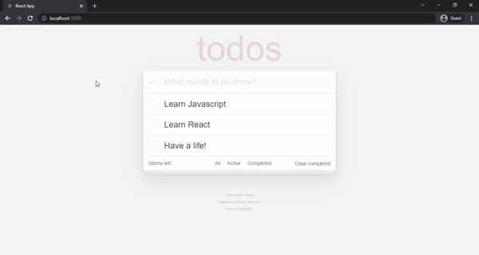

# TODO APP

This project has a to-do list. Hooks structure was used in the project. If you click the "Active" button, you can see non-completed tasks. The "Completed" button shows the completed tasks. When you click on the "Clear Completed" button happening tasks are deleted.



## Used Technologies
* 

* 

* 

## Installation
First clone the project.
```
git clone https://github.com/saglamburcu/react-todo-app.git
```

## Usage
After cloning the project, open it in Visual Studio Code.
```
cd react-todo-app
code .
```
Download node modules to make it work
```
npm install
```
To make it work
```
npm start
```